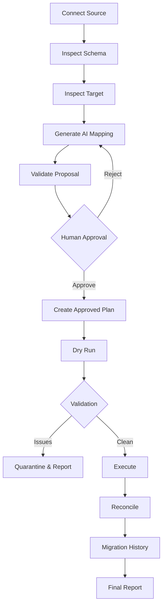

<div align="center">

# ⚗️ TRANSMUTE

### AI-assisted schema mapping. Human-approved migrations. Deterministic execution.

<p>
  
  
  
  
  
</p>

<p>
  <strong>Transmute</strong> is a controlled migration workbench for moving data between systems with different schemas without handing the migration to an LLM and hoping for the best.
</p>

<p>
  <em>LLMs propose. Humans approve. Deterministic code executes. The database tells the truth.</em>
</p>

</div>

---

## 🧬 What is Transmute?

Data migrations often look simple until the source and target systems disagree on names, structure, types, or transformations.

A field like:

```text
first_name + last_name
```

may become:

```text
full_name
```

while:

```text
date_of_birth
```

may need to become:

```text
birth_year
```

The dangerous approach is to let an AI model directly manipulate the database.

Transmute takes a different route:


The model never becomes the migration engine.

---

## ✨ The Core Idea

> **Separate intelligence from execution.**

Transmute uses AI where semantic reasoning is useful and deterministic application code everywhere correctness, validation, and database mutation matter.

| Layer | Responsibility | AI allowed? |
|---|---|---:|
| Schema Inspector | Discover actual application schemas | ❌ |
| Structural Comparison | Compare schema structures | ❌ |
| Mapping Planner | Suggest semantic relationships | ✅ |
| Human Approval | Review / approve / reject proposal | 👤 |
| Dry Run | Preview deterministic transformations | ❌ |
| Validation | Detect invalid or unsafe records | ❌ |
| Executor | Write approved records to target | ❌ |
| Reconciliation | Verify source/target outcomes | ❌ |
| History | Record what happened | ❌ |

This separation is the central architectural constraint of the project.

---

# 🏗️ Architecture

```text
                           TRANSMUTE
┌────────────────────────────────────────────────────────────────────┐
│                                                                    │
│  ┌──────────────┐        ┌──────────────────────┐                 │
│  │  Source DB   │───────▶│  Schema Inspector    │                 │
│  └──────────────┘        └──────────┬───────────┘                 │
│                                     │                             │
│                                     ▼                             │
│                          ┌──────────────────────┐                 │
│                          │ Structural Comparison│                 │
│                          └──────────┬───────────┘                 │
│                                     │                             │
│                                     ▼                             │
│                          ┌──────────────────────┐                 │
│                          │  AI Mapping Planner  │                 │
│                          │      Gemini          │                 │
│                          └──────────┬───────────┘                 │
│                                     │                             │
│                                     ▼                             │
│                          ┌──────────────────────┐                 │
│                          │   Mapping Validator  │                 │
│                          └──────────┬───────────┘                 │
│                                     │                             │
│                                     ▼                             │
│                          ┌──────────────────────┐                 │
│                          │    Human Approval    │                 │
│                          └──────────┬───────────┘                 │
│                                     │                             │
│                                     ▼                             │
│                          ┌──────────────────────┐                 │
│                          │ Deterministic Engine │                 │
│                          └──────────┬───────────┘                 │
│                                     │                             │
│                                     ▼                             │
│  ┌──────────────┐        ┌──────────────────────┐                 │
│  │ Target DB    │◀───────│ Reconciliation       │                 │
│  └──────────────┘        └──────────────────────┘                 │
│                                                                    │
└────────────────────────────────────────────────────────────────────┘
```

### Trust boundary

The AI receives **schema metadata**, not unrestricted database access.

```text
Allowed into LLM
────────────────────────────
✓ collection name
✓ field name
✓ scalar type
✓ required/optional flag
✓ controlled mapping context

Never provided to LLM
────────────────────────────
✗ database credentials
✗ MongoDB connection
✗ Mongoose models
✗ arbitrary queries
✗ raw customer documents
✗ migration write access
✗ executable transformation code
```

---

# 🗺️ Current Migration Scenario

The current workbench demonstrates a realistic customer-to-user migration.

### Source — `source_customers`

| Field | Type | Required |
|---|---|---:|
| `id` | string | ✅ |
| `first_name` | string | ✅ |
| `last_name` | string | ✅ |
| `email` | string | ❌ |
| `phone` | string | ❌ |
| `date_of_birth` | string | ❌ |

### Target — `target_users`

| Field | Type | Required |
|---|---|---:|
| `user_id` | string | ✅ |
| `full_name` | string | ✅ |
| `email_address` | string | ❌ |
| `phone_number` | string | ❌ |
| `birth_year` | number | ❌ |

### Example AI proposal

```text
id                         ────────────────▶ user_id

first_name ───────┐
                   ├──────────────────────▶ full_name
last_name  ───────┘

email                      ────────────────▶ email_address

phone                      ────────────────▶ phone_number

date_of_birth              ────────────────▶ birth_year
                                             └─ extract_year
```

The AI proposes this relationship. The application validates it. A human approves it. The deterministic engine will eventually execute it.

---

# 🛡️ Safety Rails

Transmute is intentionally restrictive.

### 01 — No unrestricted AI database access

The model never receives a MongoDB client, Mongoose model, credentials, or arbitrary query capability.

### 02 — Structured AI output

The proposal is returned as structured JSON rather than free-form text.

### 03 — Independent validation

The application validates the model output independently of the model.

### 04 — Field boundary enforcement

A proposal cannot reference a source or target field that wasn't present in the supplied schema.

### 05 — Transformation allowlist

Transformations are named operations rather than executable code.

Example:

```text
extract_year
```

not:

```text
some arbitrary JavaScript expression
```

### 06 — Fail closed

Malformed, incomplete, ambiguous, or unsafe proposals are rejected rather than silently executed.

### 07 — Human approval

Important AI-generated migration decisions require explicit human approval before execution.

---

# 🧪 Synthetic Data by Design

The project uses a deterministic synthetic dataset so the complete migration workflow can be demonstrated without exposing real customer information.

The current fixture contains **50 source customer records** with deliberately planted edge cases.

```text
CUST-001 → CUST-040   normal records
CUST-041 → CUST-044   invalid email fixtures
CUST-045 → CUST-047   null / missing-value fixtures
CUST-048               invalid date fixture
CUST-049               invalid phone fixture
CUST-050               multiple issues
```

These records are designed to exercise the migration's validation and quarantine behavior in later stages.

---

# 🚦 Project Status

Transmute is being developed as a sequence of bounded engineering loops.

### ✅ Completed

```text
LOOP 1  Database Foundation & Seed Data
       ├─ MongoDB connection layer
       ├─ Mongoose source/target models
       ├─ deterministic synthetic data
       ├─ idempotent seeding
       └─ database verification

LOOP 2  Schema Inspection & Structural Comparison
       ├─ typed schema metadata
       ├─ deterministic schema inspection
       ├─ structural comparison
       ├─ read-only inspection endpoint
       └─ regression tests

LOOP 3  AI Mapping Proposal Engine
       ├─ Gemini integration
       ├─ structured JSON output
       ├─ independent validation
       ├─ transformation allowlist
       ├─ read-only proposal endpoint
       └─ live Gemini verification
```

### 🚧 In Progress / Planned

```text
LOOP 4  Human Approval + Product UI
LOOP 5  Deterministic Dry Run + Validation
LOOP 6  Migration Execution + Reconciliation
LOOP 7  Idempotency + Rollback + Migration History
LOOP 8  UX Polish + Observability + Deployment
```

---

# 🧭 Roadmap

## Phase 1 — Foundation ✅

- [x] MongoDB Atlas connection
- [x] Source `Customer` model
- [x] Target `User` model
- [x] Synthetic migration dataset
- [x] Idempotent seed operation
- [x] Seed verification

## Phase 2 — Schema Intelligence ✅

- [x] Typed schema metadata contract
- [x] Deterministic schema inspector
- [x] Structural comparison
- [x] Read-only schema API
- [x] Schema unit tests
- [x] Database integration verification

## Phase 3 — AI Mapping ✅

- [x] Gemini integration
- [x] Server-only API credentials
- [x] Mapping proposal contract
- [x] Structured output
- [x] Independent proposal validator
- [x] Field boundary validation
- [x] Transformation allowlist
- [x] Failure handling
- [x] Live API verification

## Phase 4 — Human Approval 🚧

- [ ] Mapping review interface
- [ ] Approve / reject workflow
- [ ] Explicit approval state
- [ ] Proposal persistence
- [ ] Approval audit trail
- [ ] Loading state
- [ ] Empty state
- [ ] Validation state
- [ ] Success state
- [ ] Failure state

## Phase 5 — Dry Run & Validation 🔜

- [ ] Deterministic transformation engine
- [ ] Dry-run execution
- [ ] Per-record validation
- [ ] Invalid record detection
- [ ] Quarantine representation
- [ ] Preview statistics
- [ ] Transformation error reporting
- [ ] No-write dry-run guarantee

## Phase 6 — Execution & Reconciliation 🔜

- [ ] Human-approved plan required for execution
- [ ] Deterministic target writes
- [ ] Duplicate prevention
- [ ] Idempotent execution
- [ ] Migration result tracking
- [ ] Source/target reconciliation
- [ ] Success/failure counters
- [ ] Post-migration verification

## Phase 7 — Reliability 🔜

- [ ] Migration history
- [ ] Migration identifiers
- [ ] Audit events
- [ ] Retry-safe execution
- [ ] Rollback strategy
- [ ] Failure recovery
- [ ] Operational visibility
- [ ] Structured application logs
- [ ] Structured AI workflow logs

## Phase 8 — Product & Deployment 🔜

- [ ] Complete migration dashboard
- [ ] Responsive UI
- [ ] Clear workflow states
- [ ] Final accessibility pass
- [ ] Hosted deployment
- [ ] Production environment configuration
- [ ] Deployment smoke test
- [ ] README completion
- [ ] Agent usage documentation completion

---

# 🖥️ Planned User Experience

The final product is intended to feel like a migration control room rather than a collection of API endpoints.

```text
┌──────────────────────────────────────────────────────────────────┐
│  ⚗ TRANSMUTE                                      ● Connected     │
├──────────────────────────────────────────────────────────────────┤
│                                                                  │
│  MIGRATION WORKBENCH                                             │
│  source_customers  ───────────────────────▶  target_users        │
│                                                                  │
│  ┌──────────────────┐        ┌──────────────────┐                │
│  │ SOURCE SCHEMA    │        │ TARGET SCHEMA    │                │
│  │                  │        │                  │                │
│  │ 6 fields        │        │ 5 fields        │                │
│  └──────────────────┘        └──────────────────┘                │
│                                                                  │
│  [ Inspect Schema ]                                              │
│                                                                  │
├──────────────────────────────────────────────────────────────────┤
│                                                                  │
│  AI MAPPING PROPOSAL                                             │
│                                                                  │
│  id                         ───────────────▶ user_id             │
│  first_name + last_name     ───────────────▶ full_name           │
│  email                      ───────────────▶ email_address        │
│  phone                      ───────────────▶ phone_number         │
│  date_of_birth              ───────────────▶ birth_year           │
│                                                                  │
│  Confidence: 90–100%                                             │
│  ⚠ Risks: 2                                                      │
│                                                                  │
│                   [ Reject ]  [ Approve Mapping ]                │
│                                                                  │
└──────────────────────────────────────────────────────────────────┘
```

Later stages will add dry-run previews, validation results, quarantine information, execution progress, and reconciliation results.

---

# 🔌 API Surface

### Current endpoints

| Method | Endpoint | Purpose | Writes DB? |
|---|---|---|---:|
| `GET` | `/api/schema/inspect` | Inspect and compare source/target schemas | ❌ |
| `POST` | `/api/mapping/propose` | Generate and validate an AI mapping proposal | ❌ |

### Planned endpoints

```text
POST /api/mapping/approve
POST /api/migration/dry-run
POST /api/migration/execute
GET  /api/migration/:id
GET  /api/migration/:id/reconciliation
POST /api/migration/:id/rollback
```

These endpoints are intentionally planned as separate workflow boundaries rather than a single endpoint with unrestricted behavior.

---

# 🧰 Tech Stack

### Application

- **Next.js** — application framework and API routes
- **React** — user interface
- **TypeScript** — type-safe application logic
- **Tailwind CSS** — interface styling

### Data

- **MongoDB Atlas** — persistence
- **Mongoose** — schema/model layer

### AI

- **Google Gemini API** — semantic mapping proposals
- **`@google/genai`** — official Node.js/TypeScript SDK

### Engineering

- deterministic seed fixtures
- typed contracts
- independent validation
- focused test suites
- production builds
- Git-based loop checkpoints

---

# 🚀 Local Development

## 1. Clone

```bash
git clone https://github.com/EXCALIBUR-cmd/Transmute.git
cd Transmute
```

## 2. Install dependencies

```bash
npm install
```

## 3. Configure environment

Create `.env.local` in the project root:

```env
MONGODB_URI=your_mongodb_connection_string
GEMINI_API_KEY=your_gemini_api_key
GEMINI_MODEL=your_available_gemini_flash_model
```

Never commit `.env.local`.

## 4. Seed the source dataset

```bash
npm run seed
```

## 5. Verify the database foundation

```bash
npm run verify
```

## 6. Run the mapping test suite

```bash
npm run test:mapping
```

## 7. Run schema tests

```bash
npm run test:schema
```

## 8. Type-check

```bash
npx tsc --noEmit
```

## 9. Build

```bash
npm run build
```

---

# 🧪 Verification Philosophy

A green test is useful. It is not the whole proof.

Transmute uses multiple forms of evidence:

```text
                    ┌─────────────────┐
                    │ Automated Tests │
                    └────────┬────────┘
                             │
             ┌───────────────┼───────────────┐
             ▼               ▼               ▼
        Type Checking    Runtime API     Build Check
             │               │               │
             └───────────────┼───────────────┘
                             ▼
                   Database Before/After
                             │
                             ▼
                      Final Acceptance
```

Important invariants are checked explicitly.

For example:

```text
source_customers: 50 → 50

target_users:      0 → 0
```

during proposal generation and read-only stages.

---

# 📊 Current Reliability Checks

The current implementation verifies:

- [x] source record count
- [x] duplicate source IDs
- [x] target collection remains empty during pre-migration stages
- [x] normal fixture retrieval
- [x] invalid email fixtures
- [x] null-value fixtures
- [x] invalid date fixture
- [x] invalid phone fixture
- [x] multi-issue fixture
- [x] schema contract
- [x] mapping output contract
- [x] unknown field rejection
- [x] invalid confidence rejection
- [x] unsupported transformation rejection
- [x] malformed AI output handling
- [x] live Gemini proposal generation

---

# 🧠 AI Usage Philosophy

Transmute is AI-assisted, not AI-controlled.

The LLM is intentionally responsible for the part humans are traditionally bad at automating with rigid rules: **semantic interpretation**.

Everything downstream of that interpretation is increasingly deterministic.

```text
             SEMANTIC                      DETERMINISTIC
                ◀──────────────────────────────────▶

             Gemini                         Application
                │                              │
                ▼                              ▼
          “What maps?”                 “Is this valid?”
                                              │
                                              ▼
                                      “Was it approved?”
                                              │
                                              ▼
                                       “What gets written?”
                                              │
                                              ▼
                                       “Did it reconcile?”
```

---

# 🧱 Non-Goals

Transmute is intentionally not trying to become:

- a general-purpose database administration tool
- an unrestricted autonomous migration agent
- an arbitrary code execution platform
- a replacement for human migration review
- a system that sends entire production databases to an LLM

The project focuses on a controlled migration workflow where AI provides useful reasoning without becoming an uncontrolled actor.

---

# 🔭 Future Possibilities

The architecture leaves room for later improvements without changing the trust model.

Potential extensions include:

- additional database connectors
- schema versioning
- richer transformation libraries
- confidence-based review queues
- migration scheduling
- dry-run diffs
- record-level remediation suggestions
- migration history dashboards
- role-based approvals
- approval policies for high-risk mappings
- connector-specific reconciliation strategies

These are intentionally outside the current assessment scope unless they become necessary for the core workflow.

---

# 📁 Project Structure

The repository is organized around the migration workflow rather than around one large application module.

```text
migration-workbench/
│
├── src/
│   ├── app/
│   │   └── api/
│   │       ├── schema/
│   │       └── mapping/
│   │
│   ├── lib/
│   │   ├── ai/
│   │   ├── schema/
│   │   └── db.ts
│   │
│   ├── models/
│   │
│   ├── seed/
│   │
│   ├── test/
│   │
│   └── types/
│
├── AGENT_USAGE.md
├── README.md
├── package.json
└── .env.local
```

The structure will evolve as the approval, dry-run, execution, reconciliation, and history layers are introduced.

---

# 🤝 Development Workflow

The project is built in bounded engineering loops.

Each loop follows the same discipline:

```text
Objective
   ↓
Context Boundary
   ↓
Architecture Invariants
   ↓
Implementation
   ↓
Tests
   ↓
Runtime Verification
   ↓
Forensic Review
   ↓
Git Checkpoint
   ↓
Exit Conditions
```

This keeps individual changes reviewable and prevents a coding agent from silently turning a small feature into an uncontrolled refactor.

---

# 🤖 Agent-Assisted Development

Coding agents are used as implementation assistants, not as autonomous owners of the system.

Human engineering work includes architecture, scope definition, database/environment setup, API configuration, review of agent changes, verification, debugging decisions, and final acceptance.

Agent-assisted implementation includes bounded feature development, boilerplate, focused tests, API wiring, and implementation troubleshooting.

The development record is maintained in:

👉 **[`AGENT_USAGE.md`](./AGENT_USAGE.md)**

That file records the actual division of work, representative prompts, meaningful corrections, rejected approaches, and verification evidence.

---

# 📜 Design Principles

### Principle 1 — Inspect before interpreting

The system should know what the schemas actually contain before any AI reasoning starts.

### Principle 2 — Propose before executing

AI output is a candidate plan, not an instruction to mutate a database.

### Principle 3 — Validate outside the model

Never assume that valid JSON means valid migration logic.

### Principle 4 — Human approval is explicit

Important AI-generated actions should cross a clear human trust boundary.

### Principle 5 — Execution is deterministic

The same approved mapping should produce the same transformation behavior.

### Principle 6 — Evidence beats confidence

The system should prove what happened with tests, logs, counts, and reconciliation rather than relying on optimistic status messages.

---

# 📌 Project Snapshot

| Area | Current State |
|---|---|
| Database foundation | ✅ Complete |
| Schema inspection | ✅ Complete |
| AI mapping proposal | ✅ Complete |
| Live Gemini integration | ✅ Verified |
| Human approval | 🚧 Planned |
| Dry run | 🚧 Planned |
| Validation/quarantine | 🚧 Planned |
| Migration execution | 🚧 Planned |
| Reconciliation | 🚧 Planned |
| Idempotency | 🚧 Planned |
| Rollback | 🚧 Planned |
| Migration history | 🚧 Planned |
| Final UI | 🚧 Planned |
| Hosted deployment | 🚧 Planned |
| Final documentation | 🚧 Planned |

---

# 🏁 End State

The finished Transmute workflow is intended to look like this:



The final result should answer four questions clearly:

```text
What did the AI propose?
        ↓
What did the human approve?
        ↓
What did the deterministic engine execute?
        ↓
Did the database end up in the expected state?
```

---

<div align="center">

### ⚗️ Transmute

**From schema ambiguity → approved mapping → verified migration.**

Built with TypeScript, Next.js, MongoDB, and Gemini — with deterministic engineering around the AI.

<br />

<a href="https://github.com/EXCALIBUR-cmd/Transmute">GitHub Repository</a>

</div>
